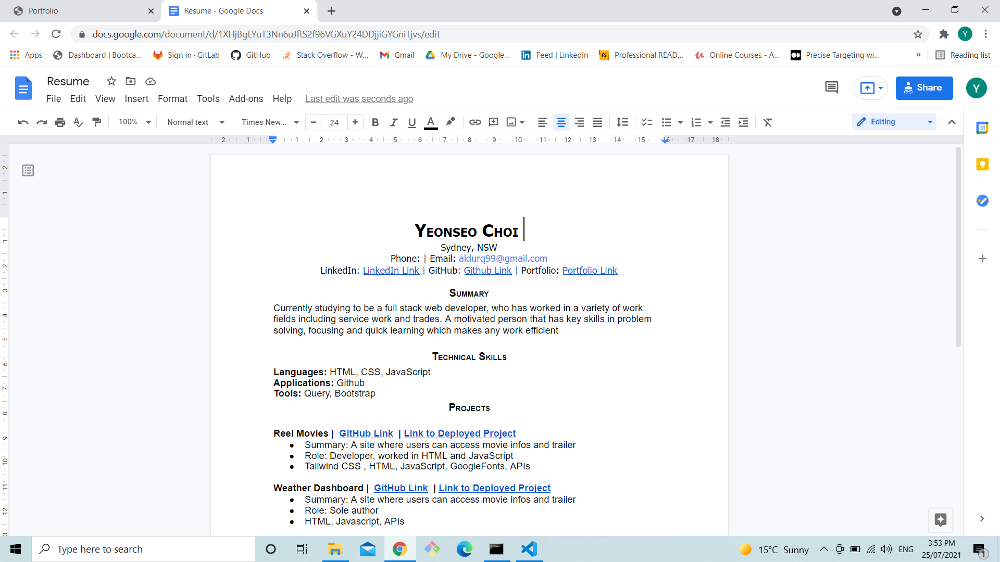
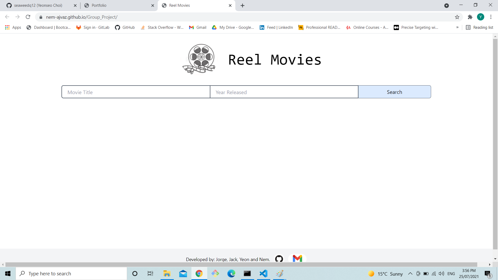
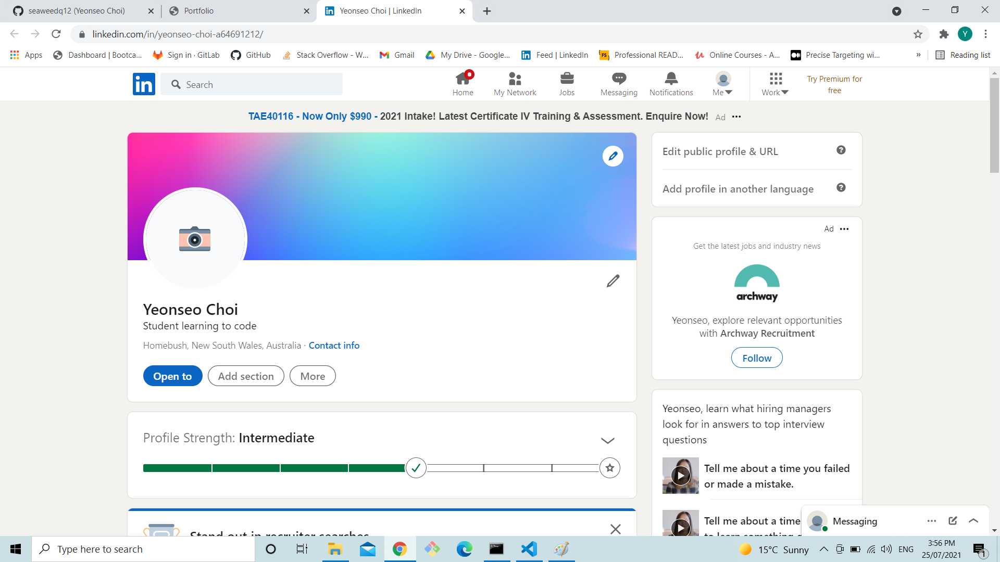

# Update Portfolio

## task

Updating our portfolio we made with resume, works and linkedin profile 

## Url

https://seaweedq12.github.io/Portfolio/

## Work

1. resume linked with a google drive link with the resume on it

2. three of my work was add to the work section with link to the live page

3. linkedin profile updated (didn't have much things i could add)

